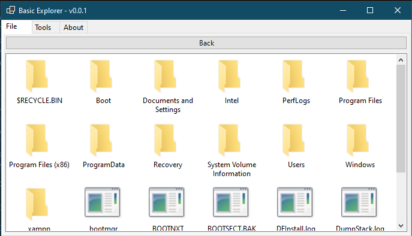
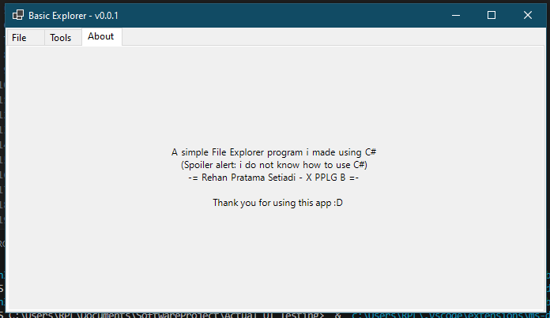

# C# File Explorer
A simple File Explorer program made using WinForms in C#.

# Build Instruction
W.I.P

# Developer Notes
I honestly don't know how to use C#. This project was meant for school project, but eh, it's kinda cool.